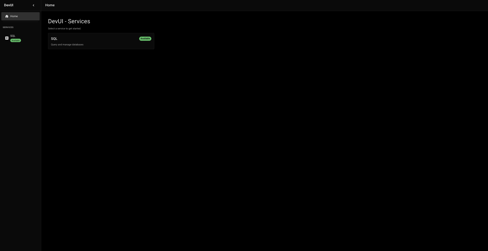
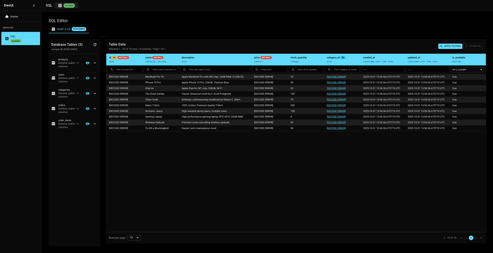

# DevUI - Development Tools UI

An Axum router that adds a `/dev/ui` route to your Axum application, serving a React-based development tools interface.

## Features

- 🛠️ **Axum Router**: Native Axum router that can be nested into your existing Axum application
- ⚛️ **React SPA**: Modern React TypeScript single-page application
- 🚀 **Axum Integration**: Built specifically for Axum applications
- 📱 **Responsive UI**: Modern, clean interface for development tools
- 🔧 **Embedded Assets**: React app is embedded in the Rust binary at compile time

## Screenshots

### DevUI Home Dashboard

The DevUI home page provides an overview of all available development tools and services.



### SQL Editor - Table Browser

Browse and explore database tables with automatic schema discovery. View table relationships, column types, and foreign key constraints.



### SQL Editor - Data Viewer

View table data with advanced filtering, pagination, and foreign key navigation. Supports all PostgreSQL data types.


## Installation

### Add to your Cargo.toml

Add `devui` to your project dependencies:

```toml
[dependencies]
devui = "0.0"  # Check https://crates.io/crates/devui for the latest version
axum = "0.8"
tokio = { version = "1.0", features = ["full"] }
tower-http = { version = "0.6", features = ["cors"] }
tracing-subscriber = "0.3"
```

> **Note**: Use `devui = "0.0"` to automatically get the latest patch version (0.0.x), or specify an exact version like `devui = "0.0.1"`. Check [crates.io/crates/devui](https://crates.io/crates/devui) for the latest available version.

## Quick Start

### 1. Register the DevUI Router

Import the necessary types and register the DevUI router in your Axum application:

```rust
use axum::{response::Html, routing::get, Router};
use devui::{
    dev_ui_router, DevUIConfigBuilder, PostgresConfig, SqlConfig,
};
use tower_http::cors::CorsLayer;

#[tokio::main]
async fn main() {
    // Initialize tracing
    tracing_subscriber::fmt::init();

    // Configure SQL databases (optional)
    let sql_config = SqlConfig::new()
        .with_postgres(
            "my-database".to_string(),
            PostgresConfig {
                host: "localhost".to_string(),
                port: 5432,
                database: "mydb".to_string(),
                username: "postgres".to_string(),
                password: "password".to_string(),
                ssl_mode: Some("disable".to_string()),
            },
        );

    // Build DevUI configuration
    let dev_ui_config = DevUIConfigBuilder::default()
        .sql_config(sql_config)
        .build()
        .expect("Error building dev ui config");

    // Create DevUI router
    let dev_ui_router = dev_ui_router(dev_ui_config)
        .await
        .expect("error constructing dev_ui_router");

    // Create your main application router
    let app = Router::new()
        .route("/", get(|| async {
            Html("<h1>Welcome to My App!</h1><p>Visit <a href='/dev/ui'>/dev/ui</a> for development tools.</p>")
        }))
        // Nest the DevUI router at /dev/ui
        .nest("/dev/ui", dev_ui_router)
        .layer(CorsLayer::permissive());

    // Start the server
    let listener = tokio::net::TcpListener::bind("0.0.0.0:3000").await.unwrap();
    println!("🚀 Server starting on http://localhost:3000");
    println!("🛠️  DevUI: http://localhost:3000/dev/ui");
    axum::serve(listener, app).await.unwrap();
}
```

### 2. Access your development tools

Once your server is running, visit:
- **Main app**: http://localhost:3000/
- **DevUI**: http://localhost:3000/dev/ui

## Running the Example

The project includes a complete example with a sample PostgreSQL database. Follow these steps:

### Prerequisites

- [Docker](https://www.docker.com/get-started) and Docker Compose installed
- [Rust](https://rustup.rs/) installed

### Step 1: Start the Sample Database

The example uses a Docker Compose setup with PostgreSQL containing sample relational data:

```bash
# Navigate to the standalone example directory
cd standalone-example

# Start PostgreSQL with sample data
docker-compose up -d

# Verify the database is running
docker-compose ps
```

The database will be initialized with:
- **Database**: `devui_sample_db`
- **User**: `devui_user`
- **Password**: `devui_password`
- **Port**: `5432`

Sample tables include:
- `users` - User accounts with email and profile information
- `products` - Product catalog with categories
- `categories` - Hierarchical category structure
- `orders` - Customer orders
- `order_items` - Order line items (junction table)

All tables contain sample data with proper foreign key relationships.

### Step 2: Run the Example Server

```bash
# Run the example server (from standalone-example directory)
cargo run
```

The server will start on `http://localhost:3000` with:
- Main application at `/`
- DevUI interface at `/dev/ui`
- SQL editor at `/dev/ui/sql`

### Step 3: Explore the DevUI

1. Open your browser and navigate to http://localhost:3000/dev/ui
2. Click on the **SQL** service to explore the sample database
3. Browse tables, view data, and execute queries on the sample relational data

### Cleaning Up

When you're done, stop the database:

```bash
# Stop and remove containers (from standalone-example directory)
docker-compose down

# Remove volumes (optional - removes all data)
docker-compose down -v
```

## How it works

The `dev_ui_router` function:

1. **Creates** an Axum router with `/dev/ui` routes
2. **Serves** the React SPA for non-API routes at `/dev/ui` (assets embedded at compile time)
3. **Handles** API endpoints for backend communication at `/dev/ui/api`
4. **Nests** into your existing Axum application router

### Embedded Frontend Assets

The React frontend is embedded into the Rust binary at compile time using `rust_embed`. This means:
- ✅ **No filesystem dependencies**: The library doesn't require a separate `frontend/dist` directory at runtime
- ✅ **Self-contained**: All frontend assets are bundled with the library
- ✅ **Included in published package**: The `frontend/dist` folder is included in the published crate source
- ✅ **Works out of the box**: Just add the dependency and use it—no additional setup needed

## Architecture

```
┌─────────────────┐    ┌──────────────────┐    ┌─────────────────┐
│   HTTP Request  │───▶│  Axum Router     │───▶│  DevUI Router   │
└─────────────────┘    │  (Your App)      │    │  (/dev/ui)      │
                       └──────────────────┘    └─────────────────┘
                              │                         │
                              │                         ▼
                              │                  ┌──────────────────┐
                              │                  │  React SPA       │
                              │                  │  + API endpoints │
                              │                  └──────────────────┘
                              │
                              ▼
                       ┌──────────────────┐
                       │  Your Routes     │
                       └──────────────────┘
```

## Available Development Tools

### PostgreSQL SQL Management

**Comprehensive PostgreSQL database management** - Explore, query, and manage PostgreSQL databases with a rich set of features:

- 🗄️ **Schema Exploration**: Automatic discovery of tables, columns, and relationships
- 🔍 **Advanced Filtering**: Type-aware filters with support for all PostgreSQL data types
- 🔗 **Foreign Key Navigation**: One-click navigation through foreign key relationships
- 📄 **Pagination**: Efficient server-side pagination for large datasets
- 🎨 **Modern UI**: Responsive interface with rich metadata display

📖 **[See full PostgreSQL features documentation](SQL_POSTGRES_FEATURES.md)**

### Future Development Tools

The interface is designed to be extensible with tools like:

- **Kafka UI**: Publish and Consume kafka topics
- **API Explorer**: Test and explore API endpoints
- **Log Viewer**: View and search application logs
- **Metrics Dashboard**: Monitor application performance

## License

MIT
